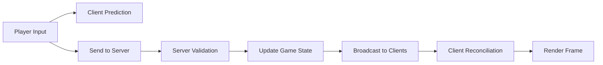

# Multiplayer-First Implementation Guide

## Why Multiplayer-First Architecture Matters

After attempting to retrofit multiplayer onto the single-player Hardmode game, several critical issues emerged:

### Problems Encountered with Retrofitting
1. **State Synchronization Chaos**: Player positions teleporting, attacks only working in one direction
2. **Input System Mismatch**: Client-side input handling incompatible with server validation
3. **Animation Conflicts**: Client animations not matching server state
4. **Performance Issues**: Game freezing during combat due to improper component access
5. **Authority Confusion**: Unclear separation between client and server responsibilities

### Core Architecture Differences

| Single-Player Architecture | Multiplayer-First Architecture |
|---------------------------|-------------------------------|
| Client handles all logic | Server handles all logic |
| Immediate input response | Input prediction + reconciliation |
| Direct state modification | State synchronization protocol |
| Local collision detection | Server-authoritative physics |
| Frame-based timing | Tick-based with interpolation |

## Implementation Strategy

### 1. Start with Networking

**DON'T**: Build game mechanics first, add networking later
**DO**: Build every system with networking from day one

```typescript
// WRONG - Single-player first approach
class Player {
  position = { x: 0, y: 0 };
  
  move(dx: number, dy: number) {
    this.position.x += dx;
    this.position.y += dy;
  }
}

// RIGHT - Multiplayer-first approach  
class Player {
  // Server-authoritative position
  serverPosition = { x: 0, y: 0 };
  // Client prediction position
  predictedPosition = { x: 0, y: 0 };
  
  // Client sends input to server
  sendInput(input: Input) {
    this.connection.send('input', input);
    this.predictMovement(input);
  }
  
  // Server validates and applies movement
  serverMove(input: Input) {
    if (this.validateInput(input)) {
      this.serverPosition.x += input.dx;
      this.serverPosition.y += input.dy;
    }
  }
}
```

### 2. Design Data Flow First



### 3. Separate Concerns Clearly

#### Client Responsibilities
- Collect input
- Predict local player movement
- Interpolate remote entities
- Render game state
- Play sounds and effects

#### Server Responsibilities  
- Validate all inputs
- Execute game logic
- Detect collisions
- Calculate combat outcomes
- Manage AI/monsters
- Broadcast state updates

### 4. Build Deterministic Systems

```typescript
// Deterministic random for synchronized generation
class SeededRandom {
  constructor(private seed: number) {}
  
  next(): number {
    this.seed = (this.seed * 9301 + 49297) % 233280;
    return this.seed / 233280;
  }
}

// Both client and server use same seed
const worldGen = new WorldGenerator(matchSeed);
```

## Critical Implementation Details

### Entity Component System (ECS)

```typescript
// Shared entity definition
interface NetworkedEntity {
  id: string;
  components: Component[];
  lastUpdated: number;
  owner?: string;
}

// Components must be serializable
interface Component {
  type: string;
  serialize(): any;
  deserialize(data: any): void;
  interpolate?(other: Component, alpha: number): void;
}
```

### Network Protocol Design

```typescript
// Efficient binary protocol
enum PacketType {
  // Reliable packets (TCP-like)
  PLAYER_SPAWN = 0x01,
  PLAYER_DESPAWN = 0x02,
  CHAT_MESSAGE = 0x03,
  
  // Unreliable packets (UDP-like)
  POSITION_UPDATE = 0x10,
  INPUT_UPDATE = 0x11,
  ENTITY_STATE = 0x12,
}

// Delta compression for updates
interface PositionUpdate {
  entityId: number; // 2 bytes
  x?: number;       // 2 bytes (optional)
  y?: number;       // 2 bytes (optional)
  timestamp: number; // 4 bytes
}
```

### Client Prediction & Reconciliation

```typescript
class ClientPrediction {
  private stateBuffer: State[] = [];
  private inputBuffer: Input[] = [];
  
  predict(input: Input) {
    // Apply input locally immediately
    this.localPlayer.applyInput(input);
    
    // Store for reconciliation
    this.inputBuffer.push({
      ...input,
      sequence: this.nextSequence++,
      timestamp: Date.now()
    });
  }
  
  reconcile(serverState: State) {
    // Find matching state in buffer
    const bufferIndex = this.findStateIndex(serverState.lastProcessedInput);
    
    // Discard old states
    this.stateBuffer.splice(0, bufferIndex);
    this.inputBuffer.splice(0, bufferIndex);
    
    // Apply server state
    this.localPlayer.setState(serverState);
    
    // Replay unacknowledged inputs
    for (const input of this.inputBuffer) {
      this.localPlayer.applyInput(input);
    }
  }
}
```

### Lag Compensation

```typescript
class CombatSystem {
  // Server-side hit detection with lag compensation
  checkHit(attacker: Player, attack: Attack, timestamp: number) {
    // Calculate how far back to rewind
    const latency = Date.now() - timestamp;
    const rewindTime = Math.min(latency, MAX_REWIND_TIME);
    
    // Rewind world state
    const historicalPositions = this.history.getPositionsAt(Date.now() - rewindTime);
    
    // Check hit in the past
    return this.detectHit(attacker, attack, historicalPositions);
  }
}
```

## Development Workflow

### Phase 1: Minimal Networked Game
1. **Two squares on screen** that can move
2. **Server validates movement**
3. **Both players see each other**
4. **Smooth movement with prediction**

### Phase 2: Add Combat
1. **Simple hitbox attacks**
2. **Server-side hit detection**
3. **Damage synchronization**
4. **Death and respawn**

### Phase 3: Add World
1. **Synchronized world generation**
2. **Collision detection**
3. **Chunk streaming**
4. **Area of interest**

### Phase 4: Add Features
1. **Multiple attack types**
2. **Character classes**
3. **Monsters with AI**
4. **Progression system**

## Common Pitfalls to Avoid

### 1. Client Authority
```typescript
// NEVER trust client for:
- Position updates (validate movement)
- Health/damage (calculate server-side)
- Inventory/items (server manages)
- Random outcomes (use server seed)
```

### 2. Blocking Operations
```typescript
// BAD - Blocks game loop
async function gameLoop() {
  const data = await database.query('...');
  updateWorld(data);
}

// GOOD - Non-blocking
function gameLoop() {
  updateWorld();
  // Database operations in separate worker
}
```

### 3. State Mutation
```typescript
// BAD - Direct mutation
player.health -= damage;

// GOOD - Through systems
combatSystem.applyDamage(player, damage);
```

## Testing Strategy

### 1. Network Condition Simulation
```typescript
class NetworkSimulator {
  constructor(
    private latency: number = 50,
    private packetLoss: number = 0.01,
    private jitter: number = 10
  ) {}
  
  send(packet: Packet) {
    if (Math.random() < this.packetLoss) return;
    
    const delay = this.latency + (Math.random() - 0.5) * this.jitter;
    setTimeout(() => this.deliver(packet), delay);
  }
}
```

### 2. Automated Testing
```typescript
// Test client prediction
test('client prediction reconciles correctly', () => {
  const client = new GameClient();
  const server = new GameServer();
  
  // Simulate input
  client.sendInput({ move: 'right' });
  
  // Simulate server response with latency
  setTimeout(() => {
    server.processInput();
    client.receiveUpdate(server.getState());
    
    // Verify positions match
    expect(client.position).toEqual(server.position);
  }, 100);
});
```

## Performance Optimization

### 1. Update Frequency
```typescript
class NetworkOptimizer {
  // Different update rates for different data
  sendUpdates() {
    // Positions: Every 50ms (20Hz)
    if (Date.now() - this.lastPositionUpdate > 50) {
      this.sendPositionUpdates();
    }
    
    // States: Only on change
    if (this.stateChanged) {
      this.sendStateUpdate();
    }
    
    // Stats: Every 1000ms
    if (Date.now() - this.lastStatsUpdate > 1000) {
      this.sendStatsUpdate();
    }
  }
}
```

### 2. Spatial Partitioning
```typescript
class SpatialGrid {
  private grid: Map<string, Set<Entity>> = new Map();
  
  getNearbyEntities(position: Vector2, radius: number): Entity[] {
    const results: Entity[] = [];
    const cellSize = 100;
    
    const minX = Math.floor((position.x - radius) / cellSize);
    const maxX = Math.floor((position.x + radius) / cellSize);
    
    for (let x = minX; x <= maxX; x++) {
      for (let y = minY; y <= maxY; y++) {
        const cell = this.grid.get(`${x},${y}`);
        if (cell) results.push(...cell);
      }
    }
    
    return results;
  }
}
```

## Deployment Considerations

### Server Architecture
```yaml
# docker-compose.yml
version: '3.8'
services:
  game-server:
    image: hardmode-server
    environment:
      - NODE_ENV=production
      - TICK_RATE=60
      - PORT=8080
    deploy:
      replicas: 3
      resources:
        limits:
          cpus: '2'
          memory: 2G
  
  redis:
    image: redis:alpine
    command: redis-server --appendonly yes
  
  nginx:
    image: nginx
    ports:
      - "80:80"
      - "443:443"
    volumes:
      - ./nginx.conf:/etc/nginx/nginx.conf
```

### Monitoring
```typescript
class ServerMonitor {
  metrics = {
    tickTime: new Histogram(),
    playerCount: new Gauge(),
    bandwidth: new Counter(),
    errors: new Counter()
  };
  
  recordTick(duration: number) {
    this.metrics.tickTime.observe(duration);
    
    if (duration > 16.67) { // Slower than 60 FPS
      logger.warn('Slow tick detected', { duration });
    }
  }
}
```

## Conclusion

Building multiplayer-first is not just about adding networking to a game - it's about fundamentally architecting every system with distributed state in mind. The pain of retrofitting multiplayer onto Hardmode demonstrates why this approach is critical. By following this guide and building with networking as the core constraint from day one, you'll create a stable, scalable multiplayer game that avoids the pitfalls of retrofit attempts.